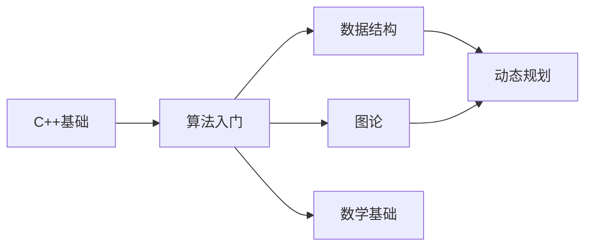

# 🏆 信奥知识库

欢迎来到信息学奥赛（OI）学习平台！

这里是为准备信息学竞赛的学生打造的系统性学习资源，涵盖从 C++ 基础到高级算法的完整知识体系。

---

## 📚 知识库导航

-   :material-language-cpp:{ .lg .middle } __C++ 基础__

    ---

    从零开始学习 C++，掌握语法、STL 和输入输出优化

    [:octicons-arrow-right-24: 开始学习](cpp/index.md)

-   :material-calculator-variant:{ .lg .middle } __算法入门__

    ---

    时间复杂度、排序、搜索、贪心、双指针等基础算法

    [:octicons-arrow-right-24: 开始学习](algorithms/index.md)

-   :material-graph-outline:{ .lg .middle } __数据结构__

    ---

    线性结构、树、堆、并查集、线段树等核心数据结构

    [:octicons-arrow-right-24: 开始学习](data-structures/index.md)

-   :material-vector-polyline:{ .lg .middle } __图论__

    ---

    图的存储、遍历、最短路径、最小生成树等

    [:octicons-arrow-right-24: 开始学习](graph/index.md)

-   :material-chart-line:{ .lg .middle } __动态规划__

    ---

    DP 思想、背包问题、区间 DP、树形 DP、状态压缩

    [:octicons-arrow-right-24: 开始学习](dp/index.md)

-   :material-function-variant:{ .lg .middle } __数学基础__

    ---

    质数、GCD、快速幂、组合数学等竞赛数学

    [:octicons-arrow-right-24: 开始学习](math/index.md)

---

## 🚀 学习路线

### 阶段一：C++ 基础（1-2 个月）
- [ ] C++ 语法基础
- [ ] 数据类型与控制结构
- [ ] 函数与数组
- [ ] STL 容器（vector、string、map、set）
- [ ] 输入输出优化

### 阶段二：算法入门（1-2 个月）
- [ ] 时间复杂度分析
- [ ] 排序与搜索
- [ ] 贪心算法
- [ ] 双指针与滑动窗口
- [ ] 前缀和与差分

### 阶段三：数据结构（2 个月）
- [ ] 栈、队列、链表
- [ ] 二叉树与堆
- [ ] 并查集
- [ ] 线段树与树状数组
- [ ] Trie 树

### 阶段四：图论（1-2 个月）
- [ ] 图的存储与遍历
- [ ] 最短路径算法
- [ ] 最小生成树
- [ ] 拓扑排序

### 阶段五：动态规划（2-3 个月）
- [ ] DP 基础概念
- [ ] 线性 DP
- [ ] 背包问题
- [ ] 区间 DP、树形 DP
- [ ] 状态压缩 DP

---

## 💡 学习建议

1. **理论 + 实践**：每个知识点都要配合练习题巩固
2. **代码模板**：整理自己的代码模板库，比赛时直接使用
3. **错题总结**：建立错题本，定期复习
4. **模拟比赛**：定期参加模拟赛，锻炼解题速度和心态

---

## 📖 推荐资源

- [洛谷](https://www.luogu.com.cn/) - 题库与题解
- [OI Wiki](https://oi-wiki.org/) - 信息学竞赛百科
- [Codeforces](https://codeforces.com/) - 国际竞赛平台
- [AcWing](https://www.acwing.com/) - 算法课程

---

## 🤝 参与贡献

如果你发现错误或有改进建议，欢迎联系老师反馈！

祝学习顺利，竞赛取得好成绩！🏅
